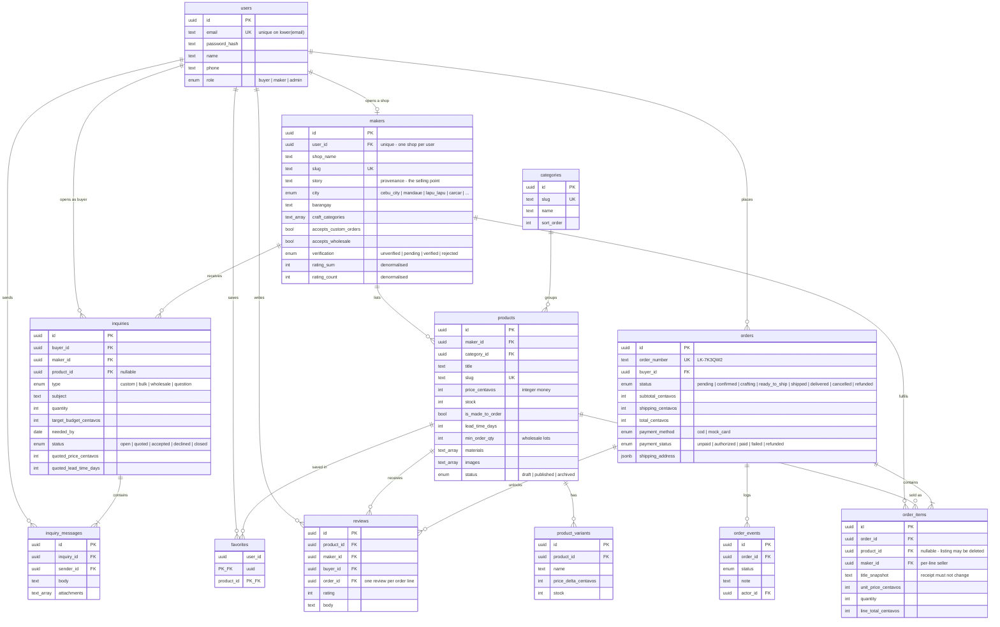
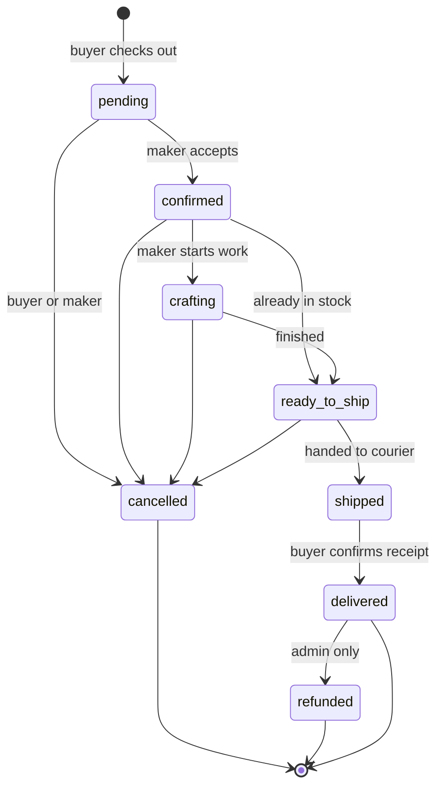
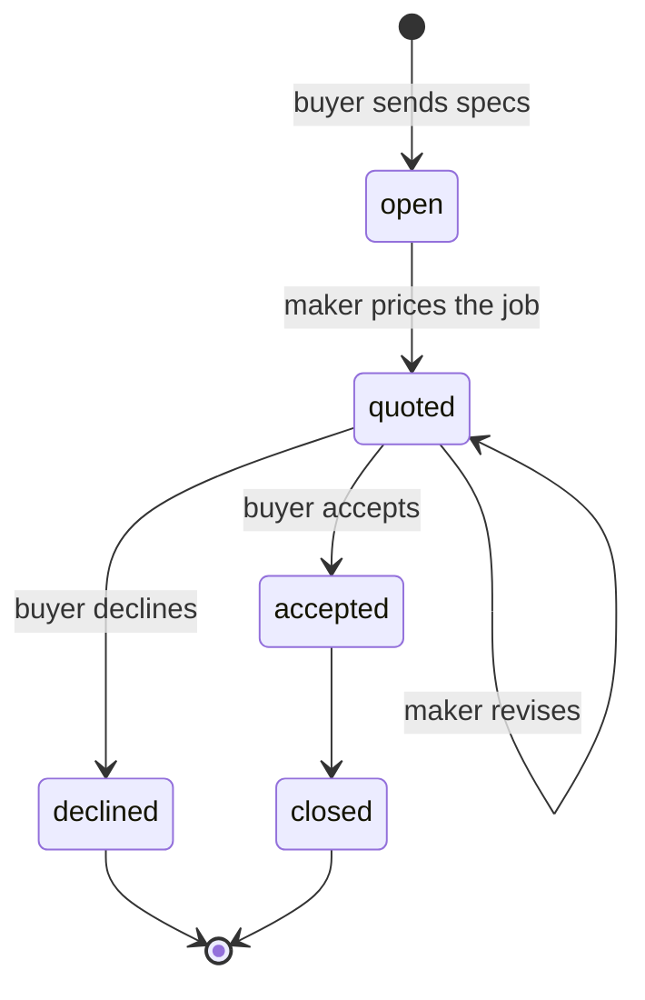

# Database design

Postgres on Neon, defined in [`server/database/schema.ts`](../server/database/schema.ts). That file
is the single source of truth — `pnpm db:push` applies it, and the TypeScript types are inferred
from it rather than declared twice.

## Entity relationship diagram

## Order lifecycle

`crafting` exists because most of this catalogue is made to order. Folding it into a generic
"processing" would hide the longest part of the wait, which is the main thing buyers ask about.

Transitions and the roles allowed to make them are declared in
[`server/api/orders/[id]/status.patch.ts`](../server/api/orders/%5Bid%5D/status.patch.ts).
Note that **buyers** confirm delivery, not makers — letting a seller close out their own
cash-on-delivery order is where COD disputes begin.

## Inquiry lifecycle

## Indexing notes

- **Full-text search** on products uses a GIN index over
  `to_tsvector('english', title || ' ' || description)`, matched with `websearch_to_tsquery` so
  quoted phrases and `OR` work the way a shopper types them. No separate search service needed at
  this scale.
- **`makers.city`** is indexed because location is a primary filter here — in Cebu the place *is*
  the craft (Carcar means footwear, Abuno means guitars).
- **`order_items.maker_id`** is indexed and denormalised off `products` so maker dashboards can
  filter their own lines without joining through a product row that may later be archived.
- **Ratings are denormalised** (`rating_sum` / `rating_count`) on both products and makers so a
  product grid does not run an aggregate per card.

## Money

Every amount is an **integer number of centavos** (`price_centavos`, `total_centavos`). Forms
accept pesos and convert at the API boundary. Floating-point money is how you end up a peso short
on a hundred-item wholesale order.
