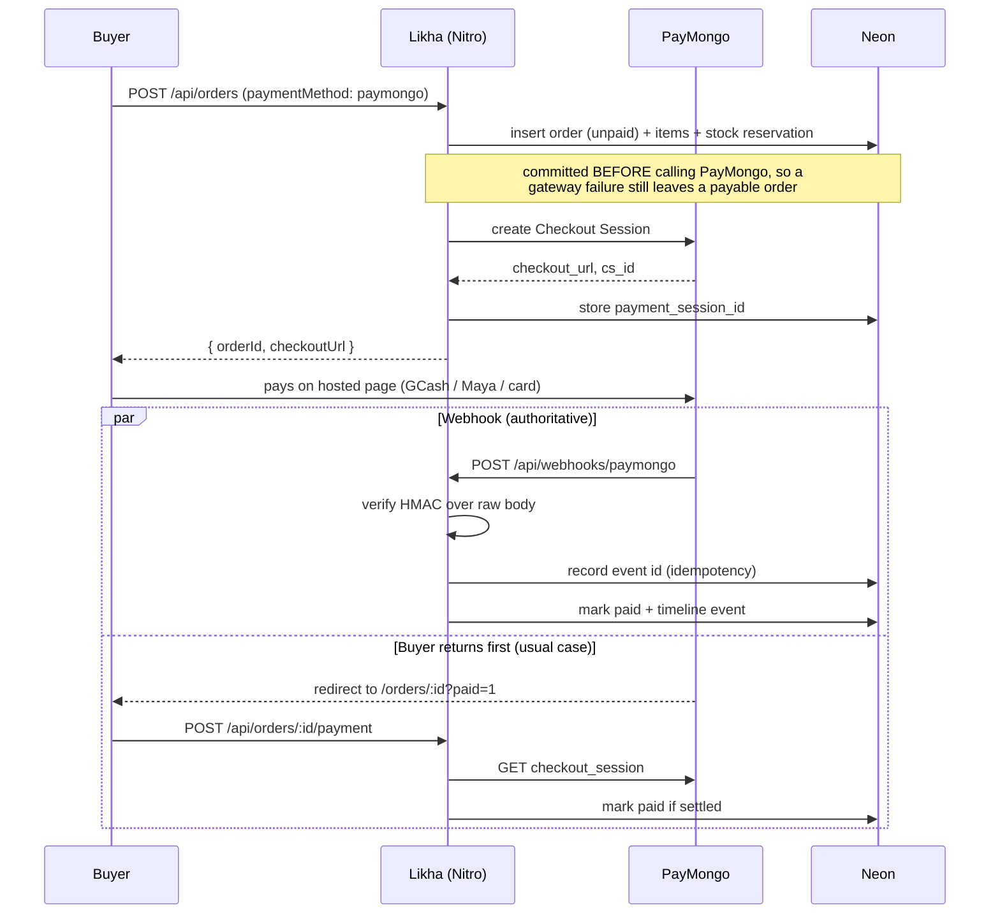

# Payments (PayMongo)

Cash on delivery is the default and needs no setup. Online payment goes through
**PayMongo Checkout Sessions**, which covers GCash, Maya, GrabPay and cards in a
single hosted flow.

If `PAYMONGO_SECRET_KEY` is blank, the checkout page falls back to a simulated
card so a fresh clone still demos end to end.

---

## Why Checkout Sessions and not Payment Intents

Card details are entered on PayMongo's page, never on ours. That keeps this
application entirely **outside PCI scope** — we never see, transmit or store a
card number. Payment Intents would mean building a card form and taking on that
obligation, in exchange for nothing a craft marketplace needs.

One hosted session also gives you every rail at once. Adding Maya later is a
config change, not a code change.

---

## Setup

### 1. Get test keys

[dashboard.paymongo.com](https://dashboard.paymongo.com) → **Developers → API Keys**.
Use the **test** secret key (`sk_test_…`) until you are ready to take real money.

```env
PAYMONGO_SECRET_KEY="sk_test_..."
PAYMONGO_RAILS="gcash,paymaya,grab_pay,card"
```

Restart the dev server — Nuxt reads `.env` once at startup.

### 2. Register the webhook

**Developers → Webhooks → Add endpoint**, pointing at:

```
https://<your-public-origin>/api/webhooks/paymongo
```

Subscribe to `checkout_session.payment.paid` and `payment.failed`. Copy the
signing secret (`whsk_…`) into:

```env
PAYMONGO_WEBHOOK_SECRET="whsk_..."
```

**Local development:** PayMongo cannot reach `localhost`, so the webhook will
never fire. You do not need a tunnel — the polling fallback below covers it. If
you want to test the webhook itself, expose the port with
`ngrok http 3000` and register the ngrok URL.

### 3. Set the return origin (mobile only)

The mobile app calls the API from `capacitor://localhost`, so the server cannot
derive a usable return URL from the request. Point it at the deployed website:

```env
NUXT_PUBLIC_APP_ORIGIN="https://likha.vercel.app"
```

Leave it blank for local web development.

---

## The flow



Both paths are idempotent and converge on the same state, so whichever arrives
second is a no-op.

---

## Security properties

| Concern | How it is handled |
| --- | --- |
| Forged webhooks | HMAC-SHA256 over `${timestamp}.${rawBody}` with the signing secret, compared using `timingSafeEqual`. Invalid → **401**. |
| Body tampering | The signature is computed on the **raw** body, read with `readRawBody` before any JSON parsing. |
| Replay | Events older than 300 s are rejected on the timestamp. |
| Duplicate delivery | `webhook_events.id` is the PayMongo event id and the primary key; a replay hits `onConflictDoNothing` and stops. |
| Underpayment | The settled amount is compared against the order total from **our** database, never trusted from the payload. A mismatch is logged and flagged, not marked paid. |
| Secret leakage | The secret key lives in server-only `runtimeConfig`. The client only ever sees the boolean `paymongoEnabled`. |
| Stale sessions settling an order | Retrying payment overwrites `payment_session_id`, so a superseded session can no longer match. |

The signature verifier has an offline test suite covering tampering, wrong
secret, replay, truncation and malformed headers:

```bash
pnpm test:signature
```

---

## Stock and abandoned payments

Stock is **reserved at order time**, before payment. That is deliberate — the
alternative oversells when two buyers check out at once — but it means an
abandoned GCash checkout would hold inventory forever.

Two things close that: cancelling an order **restores stock** for
non-made-to-order lines (made-to-order never decremented, so it is not
credited), and unpaid orders show a **Pay now** action so they can be completed
rather than stranded.

Still worth adding for production: a scheduled job that cancels PayMongo orders
left unpaid for, say, 24 hours. There is no cron here yet.

---

## Limits

- **Minimum PHP 100.** PayMongo rejects less. Checkout disables the online
  option below that and tells the buyer to use COD; the server enforces it too.
- **Payouts are PayMongo's**, not ours. This records that an order was paid; it
  does not split funds to individual makers. A real multi-vendor marketplace
  needs either PayMongo's marketplace product or a manual settlement process —
  currently money lands in one account and maker payouts are out of band.
- **No refund API wiring.** The `refunded` order status can be set by an admin,
  but it does not call PayMongo's refund endpoint.

---

## Testing with test keys

PayMongo's test mode gives you simulated rails. In the GCash test flow you get
an **Authorize / Fail** page — use it to exercise both `checkout_session.payment.paid`
and `payment.failed`.

Test cards are listed at
[developers.paymongo.com/docs/testing](https://developers.paymongo.com/docs/testing);
`4343 4343 4343 4345` succeeds, `4571 7360 0000 0014` is declined.
